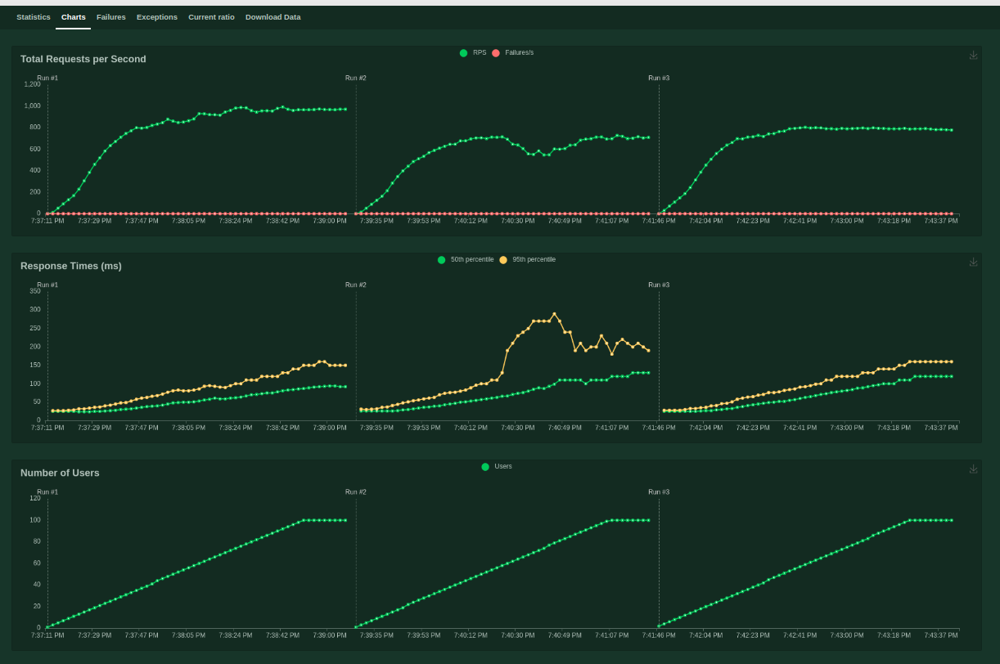
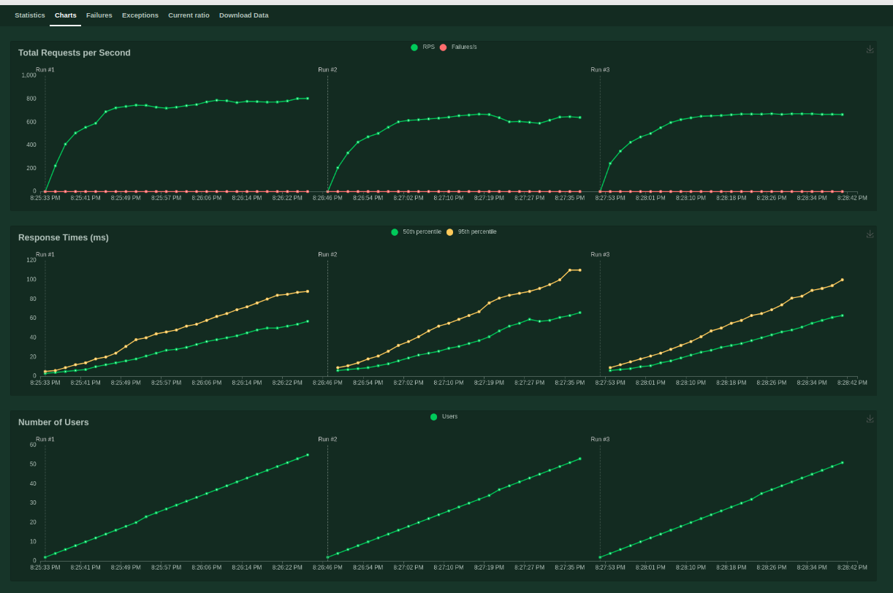

# Sql-comparison benchmark

Comparing different implementations of SQLProvider (sync and async).

## Installation

  $ pip install -e .[sql,fastapi,auth]

## Usage

Up postgres::

 $ docker compose up -d postgres

Run the application::

 $ cd benchmarks/sql-comparison
 $ SQL_COMPARISON=asyncpg uvicorn sql_comparison:app

Options are: asyncpg, sqlalchemy_async, sqlalchemy_sync.

Check health::

 $ curl http://localhost:8000/health

Check database::

 $ curl http://localhost:8000/v1/gateway/1

## Load test (interactive)

Run locust, use different venv::

  $ pip install locust
  $ cd benchmarks/sql-comparison
  $ locust --tags sleep

Options are: sleep, get.

And go to the web interface.

## Results Jan 24, 2024

"sleep" benchmark, 100 users, ramp 1/s.
Python version 3.11.4.
For all benchmarks, the throughput kept increasing all the way to 100 users. The sqlalchemy_async benchmark showed a dip between 58 and 91 users. The pool_size of 50 was not fully used with given benchmarks.

1. AsyncpgSQLDatabase: at 50 users, 860 rps, p50 response 48 ms
2. SQLAlchemyAsyncSQLDatabase: at 50 users, 706 rps, p50 response 57 ms
3. SQLAlchemySyncSQLDatabase: at 50 users, 768 rps, p50 response 52 ms

"get" benchmark, 100 users, ramp 1/s.
Python version 3.11.4.

For all benchmarks, the throughput increased fast between 1 and 12 users, and started to slowly degrade after 70 users. Especially the sqlalchemy_async benchmark degrades.

1. AsyncpgSQLDatabase: at 50 users, 815 rps, p50 response 48 ms
2. SQLAlchemyAsyncSQLDatabase: at 50 users, 767 rps, p50 response 53 ms
3. SQLAlchemySyncSQLDatabase: at 50 users, 848 rps, p50 response 46 ms

Conclusions based on this benchmark:

- All backends exibit very high throughput, with CPU times ranging between 1.2 and 1.4 ms.
- The sqlalchemy_async backend is slowest in all benchmarks, also it shows instability of the throughput at higher concurrency (>50-70 users). In other benchmarks, instabilities were consistently observed.
- The sync backend has the highest throughput for the fast query benchmark ("get"). For the slow query benchmark ("sleep") asyncpg is the fastest benchmark. Differences however were low; max 0.2 ms CPU time difference.
- Separate benchmarks showed that query compilation in the AsyncpgSQLDatabase can take 10-20 ms of CPU times, effectively limiting throughput to 50-100 rps. This penalty is not present for the SQLAlchemy backends because of caching reasons.
