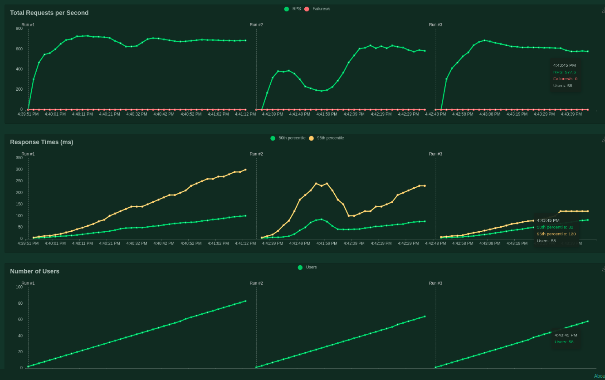

# Sql-comparison benchmark

Comparing different implementations of SQLProvider (sync and async).

## Installation

  $ pip install -e .[sql,fastapi,auth]

## Usage

Up postgres::

 $ docker compose up -d postgres

Run the application::

 $ cd benchmarks/sql-comparison
 $ SQL_COMPARISON=asyncpg uvicorn sql_comparison:app

Options are: asyncpg, sqlalchemy_async, sqlalchemy_sync.

Check health::

 $ curl http://localhost:8000/health

Check database::

 $ curl http://localhost:8000/v1/gateway/1

## Load test (interactive)

Run locust, use different venv::

  $ pip install locust
  $ cd benchmarks/sql-comparison
  $ locust

And go to the web interface.

## Results Jan 24, 2024

Using 100 users, ramp 1/s.
Python version 3.11.4.

1. AsyncpgSQLDatabase: max at 23 users, 730 rps, p50 response 23 ms
2. SQLAlchemyAsyncSQLDatabase: max at 9 users, 380 rps, p50 response 7 ms; second max at users 43, 635 rps, response 50 ms
3. SQLAlchemySyncSQLDatabase: max at 19 users, 686 rps, p50 response 19 ms

Conclusions based on this benchmark:

- The async sqlalchemy is unstable; it displays a surprising decrease of throughput from 9 concurrent users onward
- In the end the sqlalchemy async backend has slightly lower (5%) throughput than the sync backend
- Asyncpg has higher troughput, but expected is that this will deteriorate with more complex queries as sql query caching
  is omitted in this backend.
